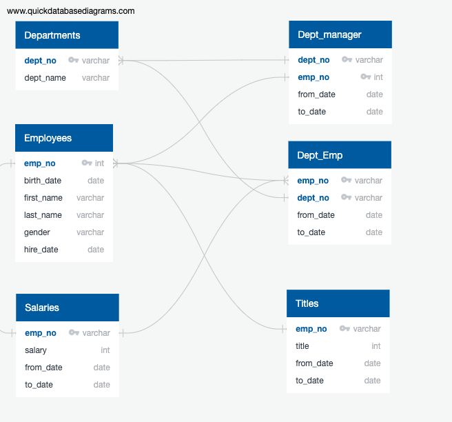
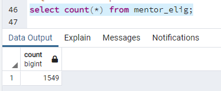
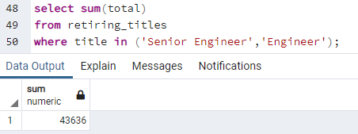

# Pewlett-Hackard-Analysis

## Overview of the analysis: 

Pewlett Hackard are a large company who are aware of an aging employee population which will be reaching retirement age soon. Ths analysis is to help to identify those who are eligible for retirement (based on company criteria) and prepare to future proof the company by identifying those eligible to participate in a mentorship program. The program would allow some eligible employees to step back to part time roles and mentor newly hired folks, rather than completely retiring. This analysis will form part of a presentation to CEO on the mentorship proposal. 

Pewlett Hackard is a large company aware of the aging workforce that is about to reach retirement age. This analysis is designed to identify those who are eligible for retirement (based on company criteria) and  those who are eligible to participate in the mentoring program. The program allows some eligible employees to return to part-time positions and coach new employees instead of retiring. This analysis will be part of the presentation to the CEO on mentorship suggestions.

## Results: 
* 1549 employees are eligible for mentor program

* The position "Senior Engineer" has the largest number of retirees (29414)

* Total of 43,636 Engineers are retirement eligible (Titles: Senior Engineer & Engineer)

* Many employees with retirement eligibility have a variety of roles in their careers, indicating deep knowledge.
## Summary: 

* 1. How many roles will need to be filled as the "silver tsunami" begins to make an impact?

The "Silver Tsunami" will create a total of 90,398 vacancies. This is almost one-third of the total employment population (300,024). 
 However, in the first year of the "Silver Tsunami" (employees born in 1952), we need to fill 21,209 positions, which we can see  to be  22,857 (1953), 23,228 (1954) and 23,104 (1955), respectively.

* 2. Are there enough qualified, retirement-ready employees in the departments to mentor the next generation of Pewlett Hackard employees?

The total of 1549 employees are eligible for a mentorship program, this number of employees is smaller than the future vacancies. The following breakdown compares the total number of employees eligible for the mentorship by department. On average, the ratio of mentors to employees in most departments is 4%, while the ratio of marketing to human resources is about 5%, indicating that the population is aging higher  than in other departments.